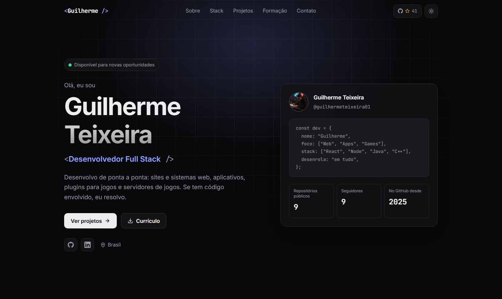

<h1 align="center">Guilherme Teixeira · Portfólio</h1>

<p align="center">
  Desenvolvedor Full Stack — web, aplicativos, plugins e servidores de jogos.
</p>

<p align="center">
  <a href="https://guilhermeteixeira01.github.io/Portfolio"></a>
  <a href="https://guilhermeteixeira01.github.io/Portfolio/resume.pdf"></a>
  <a href="https://www.linkedin.com/in/guilherme-teixeira-86499732a/"></a>
</p>

<p align="center">
  
</p>

## Sobre

Meu portfólio pessoal, feito em React. Reúne quem eu sou, as tecnologias que uso, meus principais projetos, minha formação e minhas conquistas no GitHub.

## Destaques

- **Design limpo e responsivo**, pensado para desktop, tablet e celular.
- **Tema claro e escuro**, que segue a preferência do sistema e fica salvo no navegador.
- **Dados ao vivo do GitHub**: estrelas e forks dos projetos, repositórios, seguidores e estrelas do próprio portfólio.
- **Animações leves** de entrada, que respeitam a opção de reduzir animações do sistema.
- **Sem dependências extras**: só React, com CSS puro e ícones em SVG.
- **Conteúdo centralizado** em um único arquivo, fácil de manter.
- **Currículo em PDF** gerado a partir de um HTML versionado no repositório.

## Tecnologias

<p>
  
  
  
  
  
</p>

## Rodando localmente

```bash
git clone https://github.com/guilhermeteixeira01/Portfolio.git
cd Portfolio
npm install
npm start
```

O site abre em `http://localhost:3000/Portfolio`.

## Scripts

| Comando | O que faz |
| :-- | :-- |
| `npm start` | Servidor de desenvolvimento |
| `npm test` | Roda os testes |
| `npm run build` | Gera a versão de produção em `build/` |
| `npm run deploy` | Publica o build no GitHub Pages |
| `npm run resume` | Regera `public/resume.pdf` a partir de `resume/curriculo.html` (usa Edge ou Chrome) |

## Estrutura

```
src/
├── data/profile.js     # Todo o conteúdo: textos, skills, projetos, formação, links
├── components/         # Navbar, Hero, About, Projects, Education, Contact, ícones
├── hooks/              # useGithub (API), useTheme (claro/escuro), useReveal (animações)
└── styles.css          # Design system: cores, tipografia e layout
resume/
├── curriculo.html      # Fonte do currículo
└── build.js            # Gera o PDF
```

## Personalizando

- **Textos, projetos e skills:** edite `src/data/profile.js`.
- **Cores e visual:** ajuste as variáveis no topo de `src/styles.css`, com um bloco para o tema escuro e outro para o claro.
- **Currículo:** edite `resume/curriculo.html` e rode `npm run resume`.

## Contato

- **E-mail:** guilherme.teixeira00@outlook.com
- **LinkedIn:** [guilherme-teixeira-86499732a](https://www.linkedin.com/in/guilherme-teixeira-86499732a/)
- **GitHub:** [@guilhermeteixeira01](https://github.com/guilhermeteixeira01)

---

<p align="center">Se curtiu, deixa uma ⭐ no repositório!</p>
